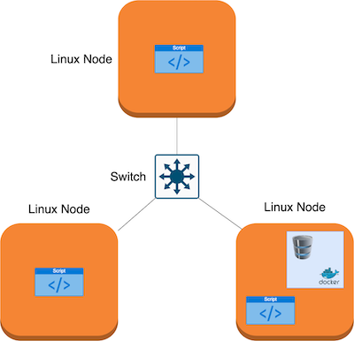

# Introduction

Cluster Monitor Agent (CMA) is an internal tool that allows users to monitor CPU/memory usage of nodes connected in a Linux cluster.
During the setup CMA deploys PostgreSQL database on a Docker container and creates neccessary tables. Every minute CMA collects and stores 
nodes' info and resource usage data into the database. This tool allows users to generate resource usage reports that
can enable a more efficient resource usage monitoring/management in the Linux cluster.

## Architecture & Design
### Architecture Diagram


### Database & Tables
- `host_info` table contains overall/static information about the hosts

| Column name      | Description                                                |
|------------------|------------------------------------------------------------|
| id               | Host's unique identifier                                   |
| hostname         | Host's name                                                |
| cpu_number       | Number of CPUs                                             |
| cpu_architecture | Architecture of CPU                                        |
| cpu_model        | CPU model                                                  |
| cpu_mhz          | CPU frequency (in MHz)                                     |
| L2_cache         | Size of Level 2 cache (in KB)                              |
| total_mem        | Total memory (in KB)                                       |
| timestamp        | Timestamp when host info was taken (time in UTC time zone) |

- `host_usage` table contains information about the resource usage of each host throughout time

| Column name    | Description                                                            |
|----------------|------------------------------------------------------------------------|
| timestamp      | Timestamp when host usage statistics was taken (time in UTC time zone) |
| host_id        | Host's unique identifier                                               |
| memory_free    | The amount of idle memory (in MB)                                      |
| cpu_idle       | Percentage of time CPU spent idle                                      |
| cpu_kernel     | Percentage of time CPU spent running kernel code                       |
| disk_io        | Number of disk I/O                                                     |
| disk_available | Memory available in the root directory of the hard disk (in MB)        |

### Script Descriptions

1. `psql_docker.sh` script assists with management of the PSQL Docker instance.
```bash
./scripts/psql_docker.sh start|stop|create [db_username][db_password]
```
2. The bash agent gathers server usage data, and then insert into the psql instance. The agent will be installed on every host/server/node. 
The agent consists of two bash scripts
    * `host_info.sh` gathers hardware configuration about the node and inserts a row into `host_info` table. 
    Run once for evey node in the cluster.
    
    ```bash
    ./scripts/host_info.sh psql_host psql_port db_name psql_user psql_password
    ```
    * `host_usage.sh` gathers information about the current resource usage of the node and inserts it into `host_usage` table.
     It will be triggered by the crontab job.
   ```bash
    ./scripts/host_info.sh psql_host psql_port db_name psql_user psql_password
    ```

3. `ddl.sql` creates `host_info` and `host_usage` tables (Note: `ddl.sql` assumes that `host_agent` database has been already created).
4. `queries.sql` performs two sql queries:
    1. Show group hosts by CPU number and sort by their memory size in descending order (within each cpu_number group)
    2. Show average used memory in percentage over 5 mins interval for each host.
 
## Usage

```bash
# use variables for readability (optional)
DB_USERNAME=postgres
DB_PASSWORD=password
PSQL_HOST=localhost
PSQL_PORT=5432

# Start a psql instance
./scripts/psql_docker.sh create DB_USERNAME DB_PASSWORD"
# Create tables
psql -h PSQL_HOST -U DB_USERNAME DB_PASSWORD
# Insert hardware specs data into host_info table
./scripts/host_info.sh PSQL_HOST PSQL_PORT host_agent DB_USERNAME DB_PASSWORD
# Insert hardware usage data into host_usage table
./scripts/host_usage.sh PSQL_HOST PSQL_PORT host_agent DB_USERNAME DB_PASSWORD
```

We automate the collection of host usage statistic using crontab.
Open the current crontab for editing by typing `crontab -e`. 
In order to schedule host usage statistic collection every minute type `crontab -e` and input the following

```bash
* * * * * bash /home/centos/dev/jrvs/bootcamp/linux_sql/host_agent/scripts/host_usage.sh localhost 5432 host_agent postgres password > /tmp/host_usage.log
```

`crontab` manual page: https://www.man7.org/linux/man-pages/man5/crontab.5.html

## Improvements / Future Work

- Visualize cluster resource usage.
- Automatically detect node failures.
- Automaticall setup crontab and provide an inteface for updating job-frequencies.
- Make a Slack/Discord chat bot for easy monitoring/querying resource usage of Linux nodes.